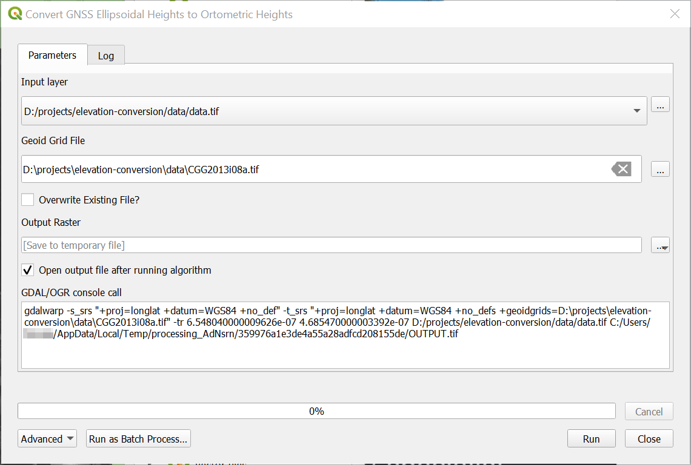

# Convert GNSS ellipsoidal heights to orthometric heights

## Introduction

QGIS tool to convert elevation values in a raster file from GNSS ellipsoidal heights to orthometric heights using a geoid grid file. Note: Horizontal coordinate system remains unchanged (input and output: EPSG:4326).

The tool is basically wrapping following `gdalwarp` command:

```shell
gdalwarp -s_srs "+proj=longlat +datum=WGS84 +no_def" ^
    -t_srs "+proj=longlat +datum=WGS84 +no_defs +geoidgrids=<GEOGRID_FILE>" ^
    -tr <X_CELL_SIZE> <Y_CELL_SIZE> <OVERWRITE> ^
    <INPUT_RASTER> <OUTPUT_RASTER>
```

And provides an interface to select:

| Parameter | Description |
| :-------- | :-----------------|
| `<GEOGRID_FILE>` | file path to grid file |
| `<X_CELL_SIZE>` | x cell size of `<INPUT_RASTER>` |
| `<Y_CELL_SIZE>` | y cell size of `<INPUT_RASTER>` |
| `<OVERWRITE>` | adds `-overwrite` if given, i.e., force overwrite `<OUTPUT_RASTER>` |
| `<INPUT_RASTER>` | input raster |
| `<OUTPUT_RASTER>` | output raster |

### Screenshot



### How to use

- Download script file `elevation_conversion.py`
- Open *Processing Toolbox* panel (see menu *Processing* and then *Toolbox*)
- Click the dropdown in the panel's toolbar with the Python icon
- Select *Add Script to Toolbox...*, find script file and add it
- You then find the tool at the bottom of the tree under *Scripts*, *Elevation Conversion* and then *Convert GNSS ellipsoidal heights to orthometric heights*

### Platform

Tested with QGIS 3.28.2 on Windows 10

## License

> Copyright (c) 2023 Dalhousie University
> 
> This program is free software: you can redistribute it and/or modify it under
> the terms of the GNU General Public License as published by the Free Software
> Foundation, either version 3 of the License, or (at your option) any later
> version.
> 
> This program is distributed in the hope that it will be useful, but WITHOUT
> ANY WARRANTY; without even the implied warranty of MERCHANTABILITY or FITNESS
> FOR A PARTICULAR PURPOSE. See the GNU General Public License for more details.
> 
> You should have received a copy of the GNU General Public License along with
> this program. If not, see <http://www.gnu.org/licenses/>.

### Additional Disclaimer

> THE SOFTWARE IS PROVIDED “AS IS”, WITHOUT WARRANTY OF ANY KIND, EXPRESS OR IMPLIED, INCLUDING BUT NOT LIMITED TO THE WARRANTIES OF MERCHANTABILITY, FITNESS FOR A PARTICULAR PURPOSE AND NONINFRINGEMENT.
> 
> IN NO EVENT SHALL THE AUTHORS OR COPYRIGHT HOLDERS BE LIABLE FOR ANY CLAIM, DAMAGES OR OTHER LIABILITY, WHETHER IN AN ACTION OF CONTRACT, TORT OR OTHERWISE, ARISING FROM, OUT OF OR IN CONNECTION WITH THE SOFTWARE OR THE USE OR OTHER DEALINGS IN THE SOFTWARE.

## Dependencies

This tool requires [PyQGIS](https://docs.qgis.org/latest/en/docs/pyqgis_developer_cookbook/index.html), [`GdalAlgorithm`](https://github.com/qgis/QGIS/blob/master/python/plugins/processing/algs/gdal/GdalAlgorithm.py) and [`GdalUtils`](https://github.com/qgis/QGIS/blob/master/python/plugins/processing/algs/gdal/GdalUtils.py).

## Resources and Relevant links

- https://webapp.csrs-scrs.nrcan-rncan.gc.ca/geod/tools-outils/applications.php?locale=en
- https://webapp.csrs-scrs.nrcan-rncan.gc.ca/geod/data-donnees/geoid.php?locale=en
- https://gis.stackexchange.com/questions/450907/how-to-convert-elevation-data-from-wgs84-itrf2008-to-nad83-cgg2013a
